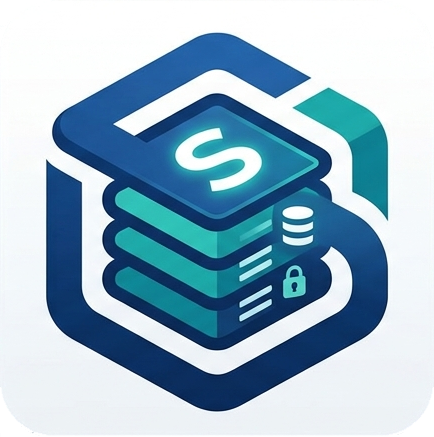

<p align="center">
  
</p>

<h1 align="center">StoonDB</h1>

<p align="center">
  <strong>A blazing-fast, native macOS control panel for your local database and phpMyAdmin.</strong>
</p>

<p align="center">
  <a href="https://github.com/dissojak/StoonDB/releases/latest"></a>
  <a href="https://github.com/dissojak/StoonDB/actions/workflows/ci.yml"></a>
  <a href="https://swift.org"></a>
  <a href="https://github.com/dissojak/StoonDB/blob/main/LICENSE"></a>
</p>

---

## ✨ Features

- **Blazing Fast:** Written purely in Swift & SwiftUI. No Electron, no web views, zero memory bloat.
- **Auto-Login:** Bypasses tedious phpMyAdmin auth prompts, instantly logging you into your local Dev environment.
- **Homebrew Native:** Effortlessly interfaces with `brew services` to manage your local MySQL background daemon safely.
- **Zero Config:** Automatically detects standard paths and ports for MySQL (`3306`) and phpMyAdmin (`8080`).

## 🚀 Installation

### Download the App

1. Go to the [Releases](https://github.com/dissojak/StoonDB/releases) page.
2. Download the latest `StoonDB-macOS-vX.Y.Z.zip` archive.
3. Unzip and drag **StoonDB.app** to your `/Applications` folder.

> **Note:** Since the app is currently distributed outside the Mac App Store, right-click the app and select **"Open"** on the first launch to bypass macOS Gatekeeper.

### Build from Source

If you prefer to compile it yourself:

```bash
git clone https://github.com/dissojak/StoonDB.git
cd StoonDB
swift build -c release
./scripts/build-release.sh
```
You will find the compiled `.app` bundle inside the `dist/` directory.

## 🛠 Requirements

- **macOS 13.0 (Ventura) or newer**
- **Homebrew** installed
- **MySQL** installed via `brew install mysql`
- **phpMyAdmin** installed and configured via local PHP server on port `8080` (See [HOW_TO_USE.md](HOW_TO_USE.md) for full setup instructions)

## 📌 Usage

Once installed, simply launch **StoonDB**. You will be presented with a modern, native window where you can:

1. **Start, Stop, or Restart** your local MySQL daemon with a single click.
2. **Open phpMyAdmin** to instantly drop into your local database dashboard in your default browser.

For changing connection strings (e.g., connecting a Spring Boot or Node.js application), see our [Usage Guide](HOW_TO_USE.md). To set up a custom app icon for your own build, check out the [Release Documentation](RELEASE.md).

## 🤝 Contributing

We welcome contributions! Please see [CONTRIBUTING.md](CONTRIBUTING.md) for details on how to set up your development environment, our coding standards, and how to submit a Pull Request.

- [Code of Conduct](CODE_OF_CONDUCT.md)
- [Security Policy](SECURITY.md)

## 📄 License & Legal

This project is licensed under the MIT License - see the [LICENSE](LICENSE) file for details. 
Please refer to [CERTIFICATION.md](CERTIFICATION.md) and [COPYRIGHT](COPYRIGHT) for additional governance materials.

---
<p align="center">Built with 🩵 for macOS</p>
